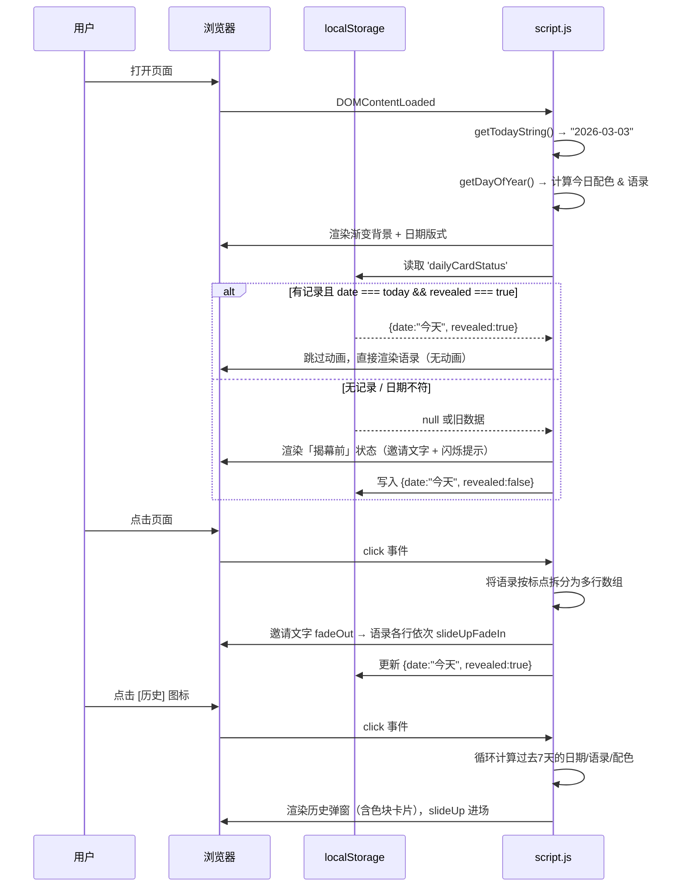

# 产品需求文档 (PRD) - 每日日签 · V2 重设计版

---

## 1. 产品路线图 (Product Roadmap)

### 核心目标 (Mission)
通过每日一次的仪式感，为用户提供一份触手可及的正能量，成为他们开启新一天的微小动力。

### 用户画像 (Persona)
- **用户**：生活在快节奏、充满压力的现代都市人。
- **核心痛点**：
  - 渴望在碎片化的时间里获得简单、积极的心理慰藉。
  - 希望通过轻量、无负担的方式培养积极心态。
  - 对粗糙的设计感到厌倦，渴望有品质感的日常小产品。

---

### V1 重设计：最小可行产品 (MVP Redesign)

> 本次迭代为对 V1 的完整推翻重建，保留核心业务逻辑，全面升级设计与交互体验。

1. **全屏沉浸式布局**：移除悬浮卡片容器，整个视口即是画布，渐变色直接作为页面背景。
2. **每日专属配色**：系统根据当天日期自动匹配一套渐变色主题（15套配色循环），每天换色。
3. **诗意版式设计**：以超大日期数字、横向分隔线、竖向分隔轴为版式骨架，语录以"诗行"形式呈现。
4. **「揭幕」交互动画**：废弃 3D 翻转，改为点击后邀请文字淡出、语录各行依次从下方滑入的逐行揭幕效果。
5. **固定翻转状态**：当日揭幕后，刷新页面仍保持揭幕状态（通过 localStorage 实现），次日自动重置。
6. **重设计历史弹窗**：历史入口保留在右下角；弹窗内每张历史卡片展示该日专属渐变色色块 + 日期 + 语录摘要，视觉上有"色彩记忆"感。

---

### V2 及以后版本 (Future Releases)

1. **背景纹理叠加**：在渐变色上叠加细微纸张或颗粒纹理，增加质感。
2. **卡片收藏夹**：用户可收藏特别喜欢的日签，在历史弹窗中标记星标。
3. **社交分享**：一键将今日日签截图分享至社交媒体（使用 `html2canvas`）。
4. **完整日历系统**：可回顾任意历史日期，而非仅限7天。
5. **主题系列**：推出「周一动力」「周末放松」等主题语录包。
6. **主屏小组件 (Widget)**：支持移动端主屏幕直接显示。

---

### 关键业务逻辑 (Business Rules) - MVP

- **语录选择**：根据 `dayOfYear % affirmations.length` 确定当天语录，保证全局一致。
- **配色选择**：同样使用 `dayOfYear % colorThemes.length` 确定当天配色，与语录同步。
- **揭幕状态持久化**：用户当天点击揭幕后，状态写入 `localStorage`。再次访问时跳过动画，直接显示语录。次日 `date` 不匹配时自动重置为未揭幕状态。
- **历史数据**：过去7天的语录和配色通过日期动态计算，无需额外存储。

---

### 数据契约 (Data Contract) - MVP

**本地存储 (`localStorage`)**：
```json
{ "date": "2026-03-03", "revealed": true }
```

**语录库（内嵌 JS，无需外部文件）**：
```javascript
// 15条语录，与15套配色一一对应
const affirmations = [ "...", "...", ... ]
```

**配色主题（内嵌 JS）**：
```javascript
// 每套主题包含渐变起止色，均适配白色文字
const colorThemes = [
  { from: '#667eea', to: '#764ba2' },  // 靛紫
  { from: '#f093fb', to: '#f5576c' },  // 玫红
  { from: '#4facfe', to: '#00f2fe' },  // 天青
  { from: '#43e97b', to: '#38f9d7' },  // 翠绿
  { from: '#fa709a', to: '#fee140' },  // 蜜桃
  { from: '#30cfd0', to: '#330867' },  // 深青紫
  { from: '#ee0979', to: '#ff6a00' },  // 炽红
  { from: '#7b4397', to: '#dc2430' },  // 紫红
  { from: '#2980b9', to: '#6dd5fa' },  // 蔚蓝
  { from: '#e96443', to: '#904e95' },  // 橙紫
  { from: '#f6d365', to: '#fda085' },  // 暖橙
  { from: '#314755', to: '#26a0da' },  // 钢蓝
  { from: '#11998e', to: '#38ef7d' },  // 绿松
  { from: '#c94b4b', to: '#4b134f' },  // 酒红
  { from: '#373b44', to: '#4286f4' },  // 午夜蓝
]
```

---

## 2. 选定原型：C「诗意版式」(Typographic Poetry)

### 设计理念
彻底去掉"卡片"概念，让版式设计本身成为视觉结构。超大日期数字锚定空间感，竖向分隔轴引导视线，语录以诗行形式逐行浮现，赋予每一天独特的仪式感。

### 视觉规格
- **背景**：每日渐变色，全屏铺满，`background: linear-gradient(135deg, from, to)`
- **文字颜色**：纯白 `#ffffff`，配合 `text-shadow` 增强可读性
- **主字体**：`-apple-system, "PingFang SC", "Helvetica Neue", sans-serif`
- **日期大字**：`font-size: clamp(6rem, 20vw, 12rem)`，`font-weight: 300`，`opacity: 0.9`
- **竖向分隔轴**：`border-left: 1.5px solid rgba(255,255,255,0.5)`，高度撑满内容区

### 页面原型

```
揭幕前 (Pre-reveal)
╔══════════════════════════════════════╗
║                                      ║
║  3                                   ║  ← 日期大字 (font-size ~10rem, thin)
║  ─────────────────                   ║  ← 细横线分隔
║  Tuesday  March                      ║  ← 星期 + 月份，小号
║                                      ║
║              │                       ║  ← 竖向分隔轴
║              │                       ║
║              │   今日的灵感           ║  ← 邀请文字
║              │   正在等你揭晓         ║
║              │                       ║
║              │   · 轻触揭晓 ·         ║  ← 闪烁提示
║              │                       ║
║                                      ║
║                              [历史]  ║  ← 右下角，小图标
╚══════════════════════════════════════╝

揭幕后 (Post-reveal) — 邀请文字淡出，语录各行依次从下方滑入
╔══════════════════════════════════════╗
║                                      ║
║  3月3日                              ║  ← 日期收缩
║  ─────────────────                   ║
║  Tuesday                             ║
║                                      ║
║              │                       ║
║              │   相信自己，           ║  ← 第1行，delay 0s
║              │                       ║
║              │   你比想象中           ║  ← 第2行，delay 0.15s
║              │                       ║
║              │   更强大。             ║  ← 第3行，delay 0.30s
║              │                       ║
║                                      ║
║                              [历史]  ║
╚══════════════════════════════════════╝

历史弹窗 (History Modal)
╔══════════════════════════════════════╗
║  ░░░░░░░░░░░░░░░░░░░░░░░░░░░░░░░░  ║  ← 模糊背景遮罩
║  ░   ┌────────────────────────┐   ░  ║
║  ░   │ 历史日签            ✕  │   ░  ║
║  ░   │ ───────────────────────│   ░  ║
║  ░   │ ┌──────┐ ┌──────┐      │   ░  ║
║  ░   │ │▓▓3/3 │ │▓▓3/2 │  ... │   ░  ║  ← 每张卡片显示该日渐变色色块
║  ░   │ │ 相信  │ │ 每一  │      │   ░  ║
║  ░   │ │ 自己… │ │ 清晨… │      │   ░  ║
║  ░   │ └──────┘ └──────┘      │   ░  ║
║  ░   └────────────────────────┘   ░  ║
╚══════════════════════════════════════╝
```

---

## 3. 架构设计蓝图

### 核心流程图



### 组件交互说明

| 文件 | 操作 | 说明 |
|------|------|------|
| `index.html` | **完整重写** | 移除卡片容器结构，改为诗意版式 HTML 骨架；新增历史弹窗 HTML |
| `style.css` | **完整重写** | 全屏渐变布局、诗意排版、揭幕动画关键帧、历史弹窗样式 |
| `script.js` | **完整重写** | 配色系统、日期版式渲染、揭幕动画逻辑、历史弹窗渲染 |

**模块调用关系**：
```
script.js
├── initApp()
│   ├── getDayOfYear(date) → index
│   ├── applyColorTheme(index) → 设置 body 渐变
│   ├── renderDateLayout(date) → 渲染日期版式
│   └── checkRevealStatus()
│       ├── [已揭幕] → renderQuoteStatic()
│       └── [未揭幕] → renderInvitation() + bindClickReveal()
│           └── onClick → revealAnimation(quote)
│               ├── fadeOutInvitation()
│               └── slideInLines(lines[], staggerDelay)
└── initHistoryModal()
    ├── bindHistoryTrigger()
    └── renderHistoryCards(7天数据)
```

### 技术选型与风险

| 项目 | 选型 | 说明 |
|------|------|------|
| 核心技术 | HTML5 + CSS3 + 原生 JS (ES6+) | 无框架依赖，零构建成本 |
| 动画方案 | CSS `@keyframes` + JS 动态添加 class | 利用 `animation-delay` 实现逐行错位揭幕 |
| 配色系统 | JS 数组 + `dayOfYear % length` | 简单可靠，无需外部数据源 |
| 字体 | 系统字体栈 (`-apple-system`, `PingFang SC`) | 零加载延迟，中英文显示均优 |
| 状态管理 | `localStorage` | MVP 阶段足够，无需引入状态库 |

**潜在风险**：

- **文字对比度**：部分渐变（如暖橙、蜜桃色调）白色文字对比度可能略低，需在 CSS 中配合 `text-shadow: 0 1px 4px rgba(0,0,0,0.3)` 兜底。
- **语录分行逻辑**：中文语录按标点（逗号、句号）拆分为多行，需预先验证15条语录均能自然分成2-3行，避免出现单行过长或只有1行的情况。
- **时区问题**：MVP 使用客户端本地时间，跨时区用户体验不一致，可接受范围内。
- **首屏渐变闪烁**：页面加载时背景色从默认白色跳变至渐变色，需在 `<style>` 中提前设置 `body { background: #333 }` 作为兜底，避免白屏闪烁。
